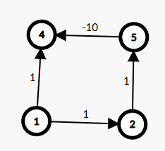

---

mindmap-plugin: basic

---
# GraphAlgorithm
V = Vetex
E = Edge
## Single-Source Shortest Path
### Dijikstra [O(VE)]
This algorithm aims to maintain a relaxed node set $\mathbf{S}$, which contains nodes having the shortest source-destination path. The algorithm performs $\mathbf{N}$ times relaxation process. Each process selects the node of minimal source-destination distance in $\mathbf{V} - \mathbf{S}$:
```cpp
std::vector<int> dis(vcnt,UNREACHABLE);
std::vector<bool> visited(vcnt,false);
```
and use this node to relaxation adjacent edges.

Used in non-negative graph. This algorithm can only be used in positive graph to obtain the correct path trace to the desitination. In graphs containing zoro weight edges, these zoro edges won't be used to the relaxation of those nodes already included in the relaxationed set. Under these circumstances, these zero weight edges are possibly connected to vetexes in set $\mathbf{S}$, and they won't be used to create paths with the vetex in visited set $\mathbf{S}$ despites that the zero edges creates the same shortest source-desitination path.

![[Pasted image 20240831200114.png]]
#### Adaptablity
- Source: Single Source.
- Positive weight graph: Shortest distance, path; 
### BF

### SPFA

## All-Pairs Shortest Path


## References
1. [Graph Editor (csacademy.com)](https://csacademy.com/app/graph_editor/)
2. 