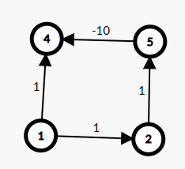

---

mindmap-plugin: basic

---
# GraphAlgorithm

V = Vetex

E = Edge

## Single-Source Shortest Path

### Dijikstra [O(VE)]

This algorithm aims to maintain a relaxed node set $\mathbf{S}$, which contains nodes having the shortest source-destination path. The algorithm performs $\mathbf{N}$ times relaxation process. Each process selects the node of minimal source-destination distance in $\mathbf{V} - \mathbf{S}$:

```cpp
std::vector<int> dis(vcnt,UNREACHABLE);
std::vector<bool> visited(vcnt,false);
```

and use this node to relaxation adjacent edges.

Used in non-negative graph. This algorithm can only be used in positive graph to obtain the correct path trace to the desitination. In graphs containing zoro weight edges, these zoro edges won't be used to the relaxation of those nodes already included in the relaxationed set. Under these circumstances, these zero weight edges are possibly connected to vetexes in set $\mathbf{S}$, and they won't be used to create paths with the vetex in visited set $\mathbf{S}$ despites that the zero edges creates the same shortest source-desitination path.



#### Priority Queue Optimize

With the optimization of priority-queue(Minimal Top Heap), the time complexity can be $\left(\mathbf{V} + \mathbf{E}\right)\log{V}$.

#### Adaptablity

- Source: Single Source.
- Positive weight graph: Shortest distance, path;

### BF

### SPFA

## All-Pairs Shortest Path

## Ring Judgement(GPT)

判环（Cycle Detection）的算法有很多种，适用于不同类型的图结构（有向图、无向图）以及不同的应用场景。以下是一些常见的判环算法：

1. DFS（深度优先搜索）
DFS 是检测环的经典方法之一，适用于有向图和无向图。

无向图：在 DFS 遍历过程中，如果访问到一个已访问过的节点且该节点不是当前节点的直接父节点，则存在环。

有向图：在 DFS 中使用颜色标记法，将每个节点标记为“未访问”、“正在访问”或“已访问”。如果在 DFS 过程中访问到一个“正在访问”的节点，则图中存在环。

2. 拓扑排序
拓扑排序通常用于检测有向无环图（DAG）。如果图中存在环，则无法完成拓扑排序。

Kahn's Algorithm：这是基于入度的拓扑排序算法。如果在排序过程中发现有节点的入度无法减为0，则存在环。
3. 并查集（Union-Find）
并查集通常用于无向图的环检测，特别是在处理图的连通性时。

无向图：在每添加一条边时，检查两个节点是否已经在同一个集合中。如果是，则添加这条边会形成一个环。
4. Bellman-Ford算法
Bellman-Ford算法不仅可以检测负环，还可以检测图中任何形式的环。在最后一次松弛操作中，如果还能松弛某条边，则存在环。

5. Floyd-Warshall算法
Floyd-Warshall算法是一种动态规划算法，用于计算任意两点之间的最短路径。该算法也可以用于环检测，如果在最终矩阵的对角线位置发现负值（即一个节点到自身的最短路径为负），则存在负环。

6. Tarjan's Algorithm（基于强连通分量）
Tarjan算法用于检测有向图中的强连通分量（SCCs）。如果一个强连通分量包含两个以上的节点，则该分量中的节点组成一个环。

7. Johnson's Algorithm
Johnson's Algorithm用于查找有向图中的所有简单环。它使用了 Tarjan 的强连通分量算法和 DFS。

8. 最小生成树（Kruskal's Algorithm）
在使用 Kruskal 算法构建无向图的最小生成树时，如果遇到一条边的两个端点已经在同一个连通分量中，则该边会形成一个环。

9. BFS（广度优先搜索）
BFS 也可以用于无向图的环检测，尤其是在稠密图中。类似于 DFS 方法，BFS 在遍历时如果发现访问到一个已访问过的节点且该节点不是当前节点的父节点，则存在环。

10. 反向边（Back Edge）
在 DFS 树中，反向边（back edge）是从一个节点指向其祖先的边。如果存在反向边，则存在环。

总结
无向图：DFS、BFS、并查集是最常用的方法。
有向图：DFS（颜色标记法）、拓扑排序、Tarjan算法和 Johnson's Algorithm 是常用的选择。
负权图：Bellman-Ford 和 Floyd-Warshall 是检测负环的有效工具。
根据图的性质和具体需求，可以选择合适的算法来进行环检测。

## References

1. [Graph Editor (csacademy.com)](https://csacademy.com/app/graph_editor/)
2.
